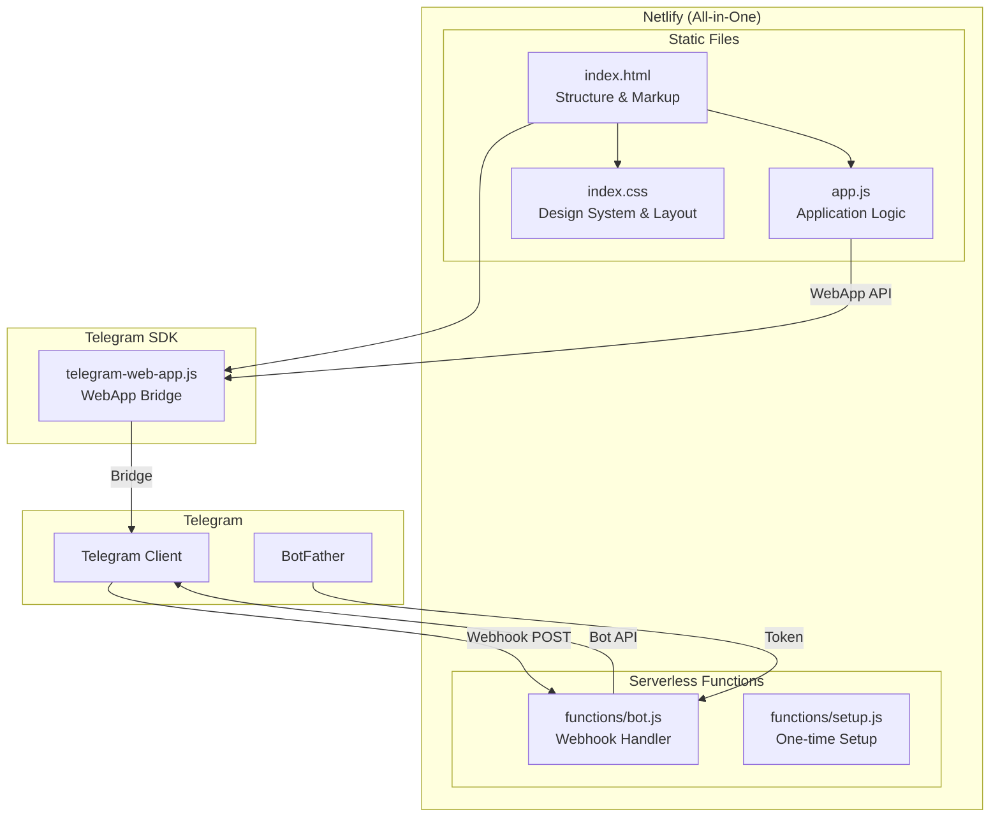
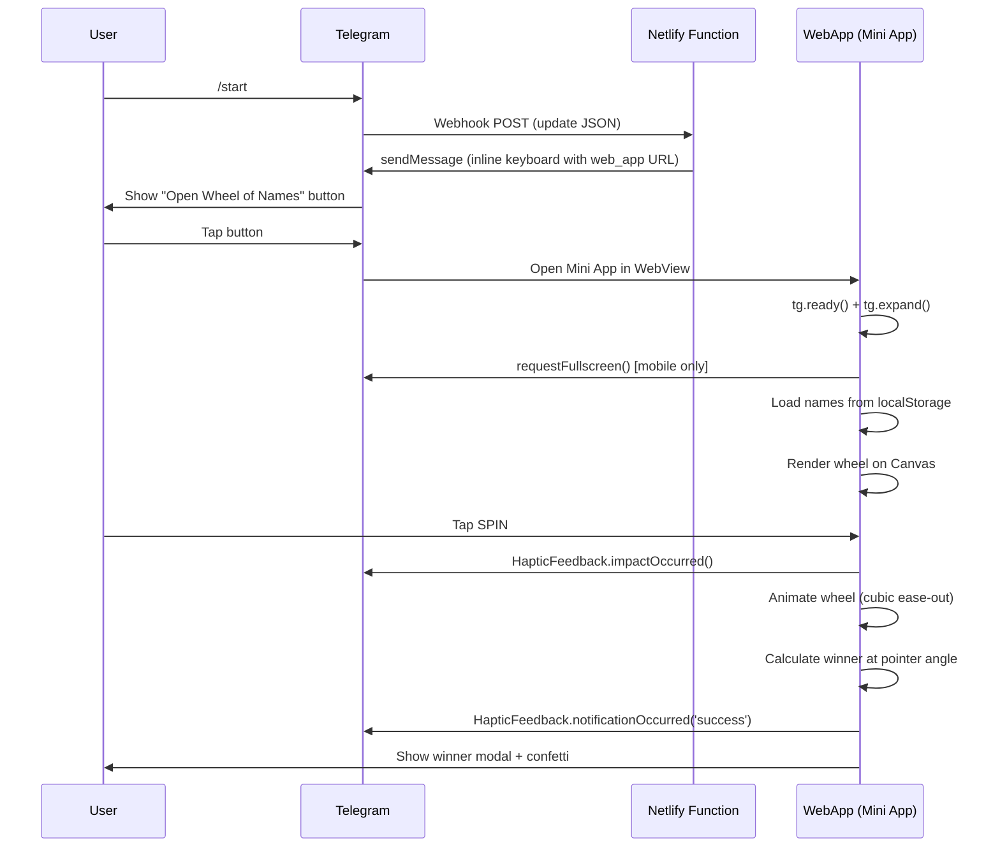

# 🎡 Wheel of Names — Telegram Mini App

<div align="center">

**A premium, fullscreen Telegram Mini App for random name selection.**

Built with pure vanilla HTML, CSS & JavaScript — zero build steps, zero frameworks.

[](https://core.telegram.org/bots/webapps)
[](LICENSE)
[](#deployment)

</div>

---

## 📋 Table of Contents

- [Overview](#overview)
- [Features](#features)
- [Architecture](#architecture)
- [Tech Stack](#tech-stack)
- [Project Structure](#project-structure)
- [Getting Started](#getting-started)
- [Configuration](#configuration)
- [Telegram SDK Integration](#telegram-sdk-integration)
- [Deployment](#deployment)
- [API Reference](#api-reference)
- [Design System](#design-system)
- [Performance](#performance)
- [Troubleshooting](#troubleshooting)
- [License](#license)

---

## Overview

Wheel of Names is a feature-rich random name picker built as a **Telegram Mini App**. Users add names to a colorful spinning wheel, tap SPIN, and the wheel animates with physics-based deceleration to select a random winner — complete with confetti celebrations and haptic feedback.

Designed for an immersive, native-like experience inside Telegram with **fullscreen mode**, **safe-area handling**, and **haptic feedback**.

### Use Cases

- 🎲 Random team assignment
- 🎁 Giveaway & raffle winner selection
- 📚 Classroom random student picker
- 🍔 "Where should we eat?" decisions
- 🎮 Game night turn order

---

## Features

### Core
| Feature | Description |
|---------|-------------|
| 🎡 **Spinning Wheel** | Canvas-rendered wheel with 60fps animation and cubic ease-out deceleration |
| ➕ **Name Management** | Add, remove, shuffle, and clear names |
| 💾 **Persistence** | Names auto-saved to `localStorage` across sessions |
| 🏆 **Winner Modal** | Animated winner announcement with confetti particle system |
| 🔄 **Remove & Spin Again** | Remove winner from wheel and immediately re-spin |

### Telegram Integration
| API | Purpose |
|-----|---------|
| `requestFullscreen()` | Immersive fullscreen on mobile devices |
| `disableVerticalSwipes()` | Prevents accidental app dismissal during interaction |
| `setHeaderColor()` | Matches Telegram header to dark theme |
| `setBottomBarColor()` | Matches Telegram bottom bar to dark theme |
| `lockOrientation()` | Locks to portrait for optimal wheel display |
| `HapticFeedback` | Tactile feedback on spin and winner events |
| `BackButton` | Native back button integration |
| `safeAreaInset` | Dynamic safe-area handling for notches and camera holes |
| `contentSafeAreaInset` | Content area insets for Telegram UI elements |

### Design & UX
- 🌙 Premium dark theme with glassmorphism effects
- ✨ Floating particle background animation
- 🎨 10-color vibrant segment palette
- 📱 Responsive layout for all screen sizes
- 🔮 Gradient accents and glow effects
- ⚡ Smooth micro-animations throughout

---

## Architecture



### Data Flow



---

## Tech Stack

| Layer | Technology | Purpose |
|-------|-----------|---------|
| **Markup** | HTML5 | Semantic structure with `viewport-fit=cover` |
| **Styling** | Vanilla CSS | Design system, glassmorphism, responsive layout |
| **Logic** | Vanilla JavaScript (ES6+) | IIFE module, Canvas API, animation engine |
| **Bot** | Netlify Functions (Serverless) | Webhook-based Telegram Bot API integration |
| **SDK** | `telegram-web-app.js` v8.0 | Telegram Mini App bridge |
| **Storage** | `localStorage` | Client-side persistence |
| **Rendering** | Canvas 2D API | Wheel rendering & confetti particles |
| **Animation** | `requestAnimationFrame` | 60fps physics-based animation |

### Why Vanilla JS?

- **Zero build step** — Deploy static files directly
- **No dependencies** — No npm packages for the frontend
- **Instant load** — No bundle parsing overhead
- **Full control** — Direct Canvas API access for smooth animation
- **Telegram-optimized** — Minimal payload for fast WebView loading

---

## Project Structure

```
wheel-of-names-app/
├── index.html                    # Main HTML entry point
├── index.css                     # Complete design system & styles
├── app.js                        # Application logic (666 lines)
├── netlify.toml                  # Netlify configuration
├── netlify/
│   └── functions/
│       ├── bot.js                # Webhook handler (serverless)
│       └── setup.js              # One-time webhook registration
├── bot.js                        # Local dev bot (polling mode)
├── package.json                  # Dependencies
├── .agents/
│   ├── SKILL.md                  # Skill reference
│   └── workflows/
│       └── wheel-of-names.md     # Development workflow
└── README.md                     # This file
```

### File Responsibilities

| File | Purpose |
|------|---------|
| `app.js` | All client-side logic in a single IIFE module (666 lines) |
| `index.css` | Complete design system, responsive rules, animations (800 lines) |
| `index.html` | Markup structure, meta tags, SDK script |
| `netlify/functions/bot.js` | **Production** — Serverless webhook handler |
| `netlify/functions/setup.js` | **One-time** — Registers webhook + bot commands |
| `bot.js` | **Local dev only** — Polling mode for testing |

---

## Getting Started

### Prerequisites

- **Node.js** ≥ 16.x (for bot only)
- A **Telegram Bot Token** from [@BotFather](https://t.me/BotFather)
- An **HTTPS URL** for hosting (Netlify, Vercel, GitHub Pages, etc.)

### Quick Start (Local Development)

```bash
# 1. Clone the repository
git clone <repo-url>
cd wheel-of-names-app

# 2. Install bot dependencies
npm install

# 3. Start the local development server
npm run dev
# → Serves at http://localhost:8080

# 4. (Optional) Expose via Cloudflare Tunnel for mobile testing
cloudflared tunnel --url http://localhost:8080 --no-autoupdate

# 5. Update WEB_APP_URL in bot.js with the tunnel URL

# 6. Start the Telegram bot
npm start
```

### Testing in Telegram

1. Open your bot in Telegram
2. Send `/start`
3. Tap **"🎡 Open Wheel of Names"**
4. The Mini App opens in fullscreen (mobile) or expanded (desktop)

---

## Configuration

### Environment Variables

Set these in the **Netlify Dashboard** → Site settings → Environment variables:

| Variable | Required | Description |
|----------|----------|-------------|
| `BOT_TOKEN` | ✅ Yes | Telegram Bot API token from [@BotFather](https://t.me/BotFather) |
| `WEB_APP_URL` | ❌ Optional | Auto-detected from Netlify site URL if not set |

### Customization

#### Segment Colors
Edit the `SEGMENT_COLORS` array in `app.js`:

```javascript
const SEGMENT_COLORS = [
    '#7c5cfc', '#ff6b9d', '#00d4aa', '#ffa726', '#29b6f6',
    '#ef5350', '#ab47bc', '#26c6da', '#d4e157', '#ff7043'
];
```

#### Theme Colors
Edit CSS variables in `index.css`:

```css
:root {
    --bg-primary: #0a0a1a;
    --bg-secondary: #12122a;
    --accent-1: #7c5cfc;
    --accent-2: #ff6b9d;
    --accent-3: #00d4aa;
    --gradient-primary: linear-gradient(135deg, #7c5cfc, #ff6b9d);
}
```

#### Spin Duration
Modify spin parameters in `app.js`:

```javascript
const totalDuration = 4000 + Math.random() * 2000; // 4-6 seconds
const totalRotation = currentRotation + (Math.PI * 2 * (5 + Math.random() * 5)) + randomOffset;
```

---

## Telegram SDK Integration

### Initialization Flow

```javascript
// 1. Signal readiness
tg.ready();

// 2. Expand to max height
tg.expand();

// 3. Theme colors
tg.setHeaderColor('#0a0a1a');
tg.setBackgroundColor('#0a0a1a');
tg.setBottomBarColor('#0a0a1a');

// 4. Disable swipe-to-close
tg.disableVerticalSwipes();

// 5. Lock portrait orientation
tg.lockOrientation();

// 6. Fullscreen (mobile only)
const platform = (tg.platform || '').toLowerCase();
const isMobile = ['android', 'android_x', 'ios'].includes(platform);
if (isMobile && tg.requestFullscreen) {
    tg.requestFullscreen();
}
```

### Platform Detection

| Platform | Fullscreen | Rationale |
|----------|-----------|-----------|
| `android` | ✅ Yes | Mobile — immersive experience |
| `android_x` | ✅ Yes | Android extended (tablets) |
| `ios` | ✅ Yes | iPhone/iPad — native feel |
| `tdesktop` | ❌ No | Desktop — standard windowed mode |
| `web` | ❌ No | Web version — standard browser |
| `macos` | ❌ No | macOS app — standard windowed |

### Safe Area Handling

CSS variables are dynamically set from JavaScript:

```css
/* Telegram safe-area variables (set by JS) */
:root {
    --tg-safe-area-top: 0px;
    --tg-safe-area-bottom: 0px;
    --tg-safe-area-left: 0px;
    --tg-safe-area-right: 0px;
    --tg-content-safe-top: 0px;
    --tg-content-safe-bottom: 0px;
}

body.tg-fullscreen {
    padding-top: calc(var(--tg-safe-area-top) + var(--tg-content-safe-top));
    padding-bottom: calc(var(--tg-safe-area-bottom) + var(--tg-content-safe-bottom));
    padding-left: var(--tg-safe-area-left);
    padding-right: var(--tg-safe-area-right);
}
```

---

## Deployment (Netlify — All-in-One)

The entire app — frontend + bot — runs on **Netlify for free**. No separate server needed!

### Step 1: Deploy to Netlify

1. Push your code to GitHub
2. Go to [netlify.com](https://netlify.com) → **Add new site** → **Import an existing project**
3. Connect your GitHub repo (`superdeddy/wheel-of-names-app`)
4. Deploy settings (auto-detected from `netlify.toml`):
   - **Publish directory:** `.`
   - **Functions directory:** `netlify/functions`
5. Click **Deploy**

### Step 2: Set Environment Variables

1. Go to **Site configuration** → **Environment variables**
2. Add:
   - `BOT_TOKEN` = `your-telegram-bot-token`
3. **Redeploy** the site (Deploys → Trigger deploy → Deploy site)

### Step 3: Register Webhook (One-Time)

After the site is deployed and environment variables are set:

1. Open your browser and visit:
   ```
   https://your-site.netlify.app/setup
   ```
2. You should see a ✅ **"Bot Setup Complete!"** confirmation page
3. This registers the webhook with Telegram — your bot is now live!

### Step 4: Test

1. Open your bot in Telegram
2. Send `/start`
3. Tap **"🎡 Open Wheel of Names"** — the app should load from Netlify!

### How It Works

```
User sends /start → Telegram → POST to /.netlify/functions/bot → Responds with Mini App button
User taps button → Telegram opens index.html from Netlify → Mini App runs in WebView
```

> **No VPS, no Railway, no always-on server needed.** The bot only wakes up when someone sends a message, and Netlify's free tier handles it all.

---

## API Reference

### Winner Detection Algorithm

The winner is determined by calculating which wheel segment intersects with the pointer at the top (12 o'clock position):

```
pointerAngle = (-π/2 - currentRotation) mod 2π
winnerIndex = floor(pointerAngle / sliceAngle)
```

Where:
- **Pointer position**: `-π/2` (top of circle in canvas coordinate system)
- **currentRotation**: Total accumulated rotation of the wheel
- **sliceAngle**: `2π / numberOfNames`

### Spin Physics

The spin uses cubic ease-out deceleration:

```
progress = elapsed / totalDuration
eased = 1 - (1 - progress)³
currentRotation = startRotation + (targetRotation - startRotation) × eased
```

### Confetti System

The confetti uses a particle system with:
- Random velocity vectors with gravity
- Rotation and angular velocity per particle
- Color variety from the segment palette
- 3-second lifetime with frame-by-frame rendering

---

## Design System

### Color Palette

| Token | Value | Usage |
|-------|-------|-------|
| `--bg-primary` | `#0a0a1a` | Main background |
| `--bg-secondary` | `#12122a` | Cards, modals |
| `--glass-bg` | `rgba(255,255,255,0.06)` | Glassmorphism panels |
| `--accent-1` | `#7c5cfc` | Primary purple accent |
| `--accent-2` | `#ff6b9d` | Pink accent |
| `--accent-3` | `#00d4aa` | Teal accent |

### Typography

- **Font**: Inter (Google Fonts) with system fallbacks
- **Heading**: 800 weight, gradient text fill
- **Body**: 500 weight, `#f0f0ff`
- **Muted**: 500 weight, `rgba(240,240,255,0.35)`

### Responsive Breakpoints

| Condition | Wheel Size | Spin Button |
|-----------|------------|-------------|
| Default | `min(85vw, 340px)` | 72×72px |
| `max-height: 650px` | `min(70vw, 280px)` | 58×58px |
| `max-height: 500px` | `min(55vw, 220px)` | 48×48px |

---

## Performance

| Metric | Value |
|--------|-------|
| **Total payload** | ~47KB (uncompressed) |
| **Dependencies** | 0 (frontend) |
| **Time to Interactive** | < 500ms |
| **Animation FPS** | 60fps (Canvas + rAF) |
| **Build step** | None required |

---

## Troubleshooting

| Issue | Solution |
|-------|----------|
| Fullscreen not working | Check `tg.platform` — only supported on mobile Telegram clients |
| Haptic feedback errors in browser | Expected — `HapticFeedback` is only available inside Telegram |
| Winner name mismatch | Fixed in v1.1 — pointer angle now correctly uses `-π/2` offset |
| Names not saving | Check `localStorage` availability and quota |
| Bot not responding | Verify `BOT_TOKEN` is correct and bot is running (`npm start`) |
| Tunnel URL changed | Re-run `cloudflared tunnel` and update `WEB_APP_URL` |

---

## License

MIT License — Built with ❤️ by **Super Deddy**

---

<div align="center">

**[⬆ Back to Top](#-wheel-of-names--telegram-mini-app)**

</div>
